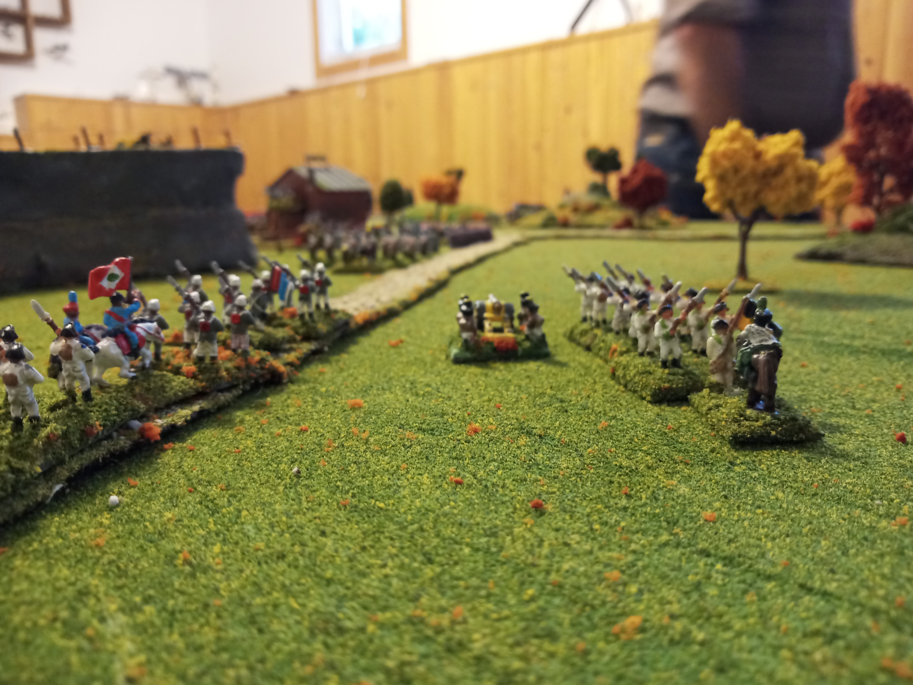
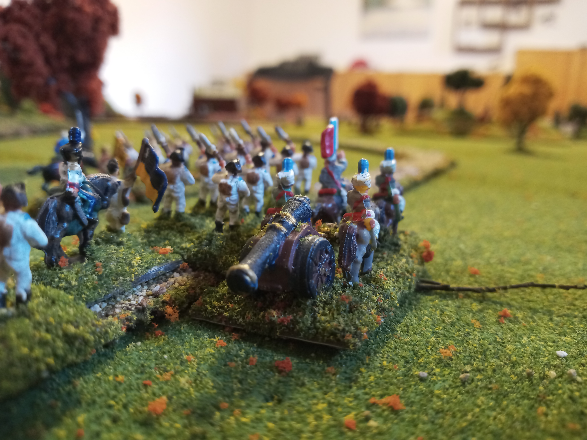
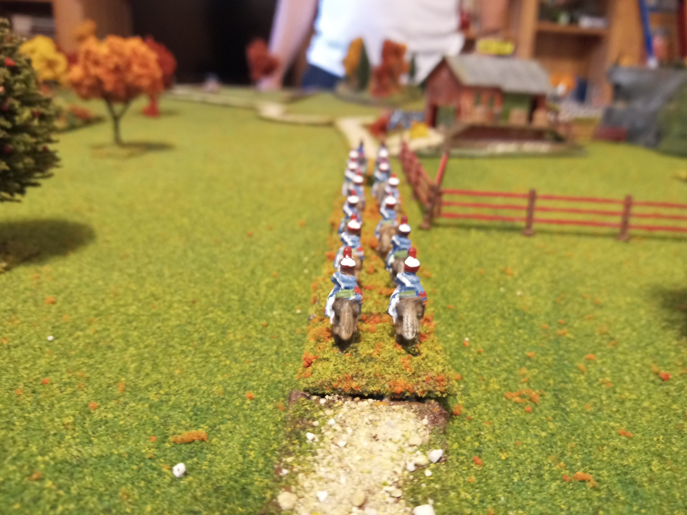
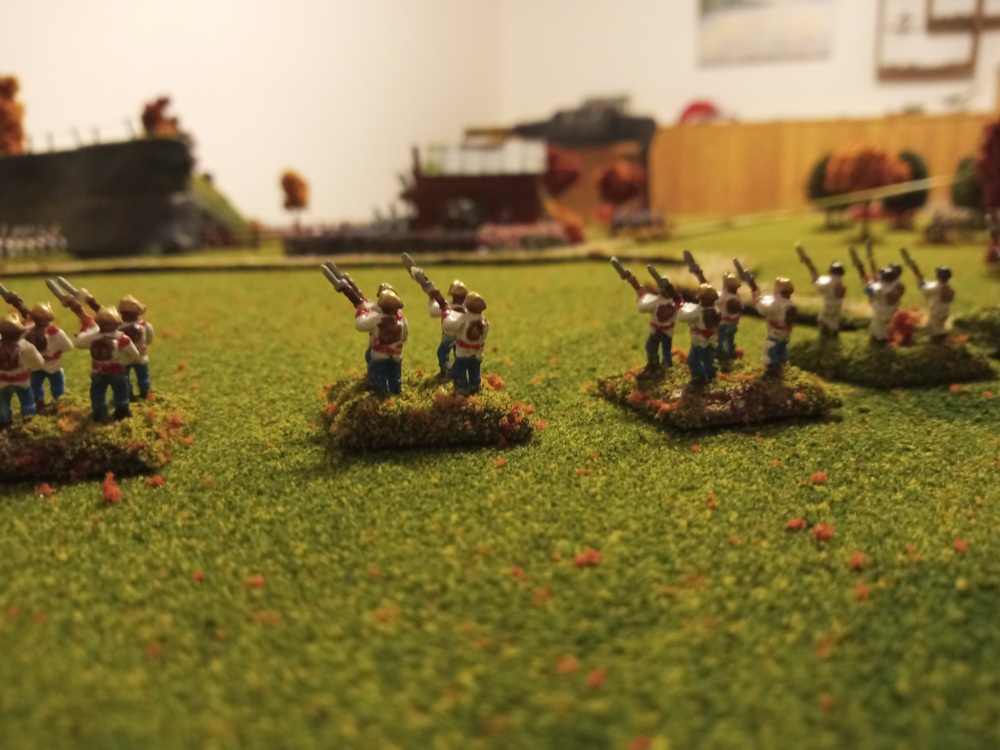
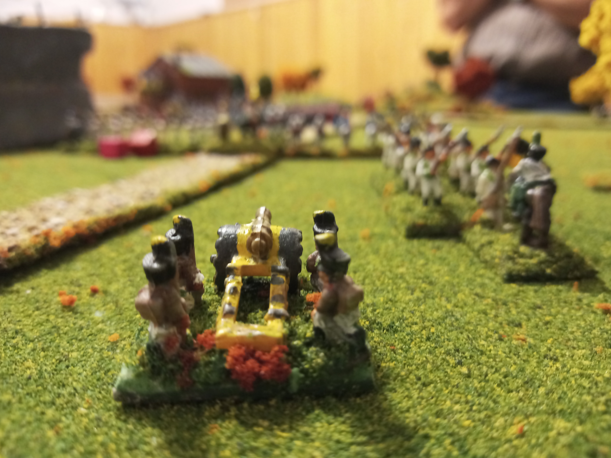
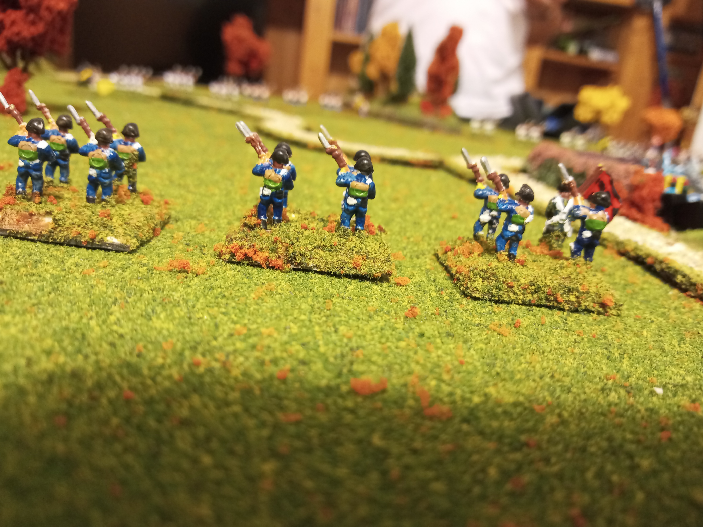
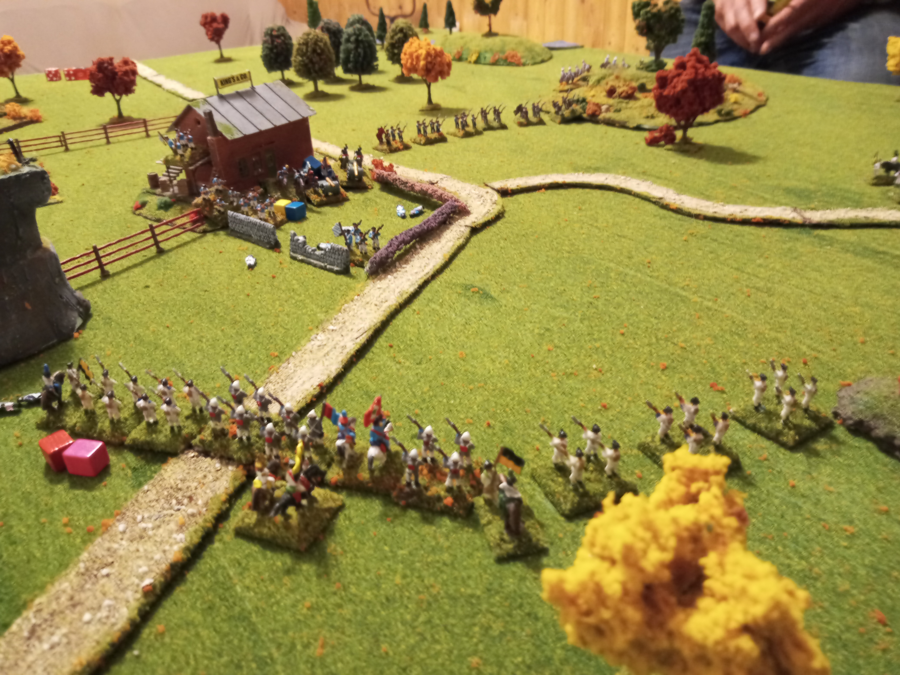
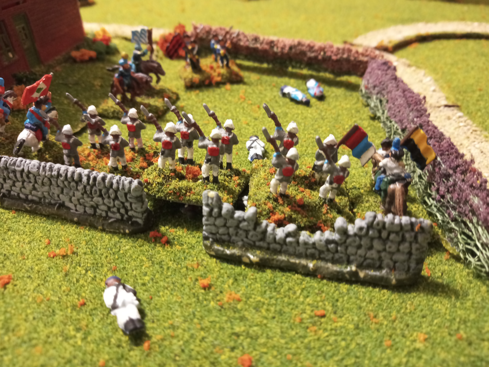
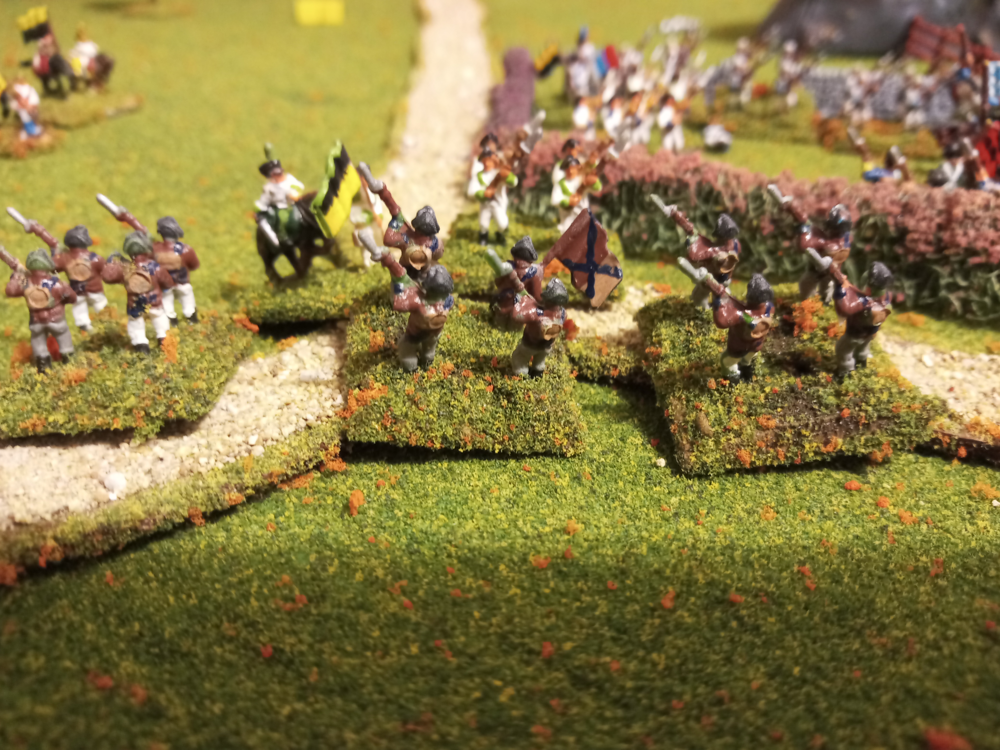

# Battle of Brandy Tavern

Played IRL 7 Aug 2022.

## Order of battle

Baverian units and allies have rushed to wards the crossroads at Brandy tavern to stop the Austrian units from joining up and advancing to wards the capital. 

Austrian calvary charged wiped out

Austrians closing in in tavern. Baverian guns taking heavy fire

French cav destroyed.
Baverian inf destroyed.

Austrians pour over wall trasking wuttenburg troops who were in open formation firing fwd

Home guard counter charge

1 Baverian gun, stragglers escaped the carnage as general Joe [Trickett] destroyed the Baverian army.

